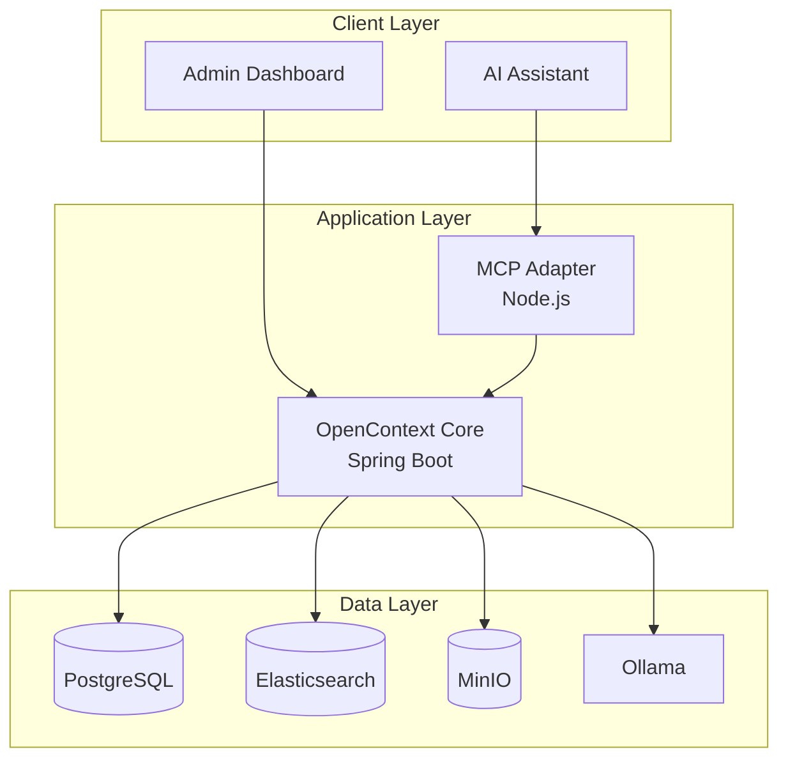

# OpenContext

[](https://opensource.org/licenses/Apache-2.0)
[](https://openjdk.org/projects/jdk/21/)
[](https://spring.io/projects/spring-boot)
[](https://reactjs.org/)
[](https://docs.docker.com/compose/)
[](https://modelcontextprotocol.io/)

**Self-Hosted RAG System for Secure Document Processing**

OpenContext is an enterprise-grade RAG (Retrieval-Augmented Generation) system designed for organizations that require complete data sovereignty. Process confidential documents without external dependencies or security compromises.

## Why OpenContext?

**The Problem**: Developers need AI assistance but can't upload sensitive code or documents to external cloud services due to security, compliance, or intellectual property concerns.

**The Solution**: OpenContext runs entirely within your infrastructure, ensuring your data never leaves your control while providing enterprise-grade search capabilities.

### Key Benefits

- **Zero External Dependencies**: All processing happens within your network
- **Self-Hosted Security**: Keep sensitive data within your infrastructure
- **Advanced Search**: Hybrid keyword + semantic search with Korean language support
- **Production Ready**: Docker Compose deployment with monitoring and logging
- **Developer Friendly**: MCP protocol integration for AI assistants like Cursor

### Demo 
[](https://github.com/user-attachments/assets/55482003-4bb8-4316-bea7-200ecf5bf92ae)

## Architecture



## Quick Start

### Prerequisites
```bash
docker --version          # 20.10+
docker compose version    # 2.0+
git --version             # Any recent version
```

**System Requirements:**
- Minimum 4GB RAM, 10GB disk space recommended

### Installation
```bash
git clone https://github.com/OpenContextAI/open-context.git
cd open-context

# Start all services (model download included)
docker compose up -d

# Verify deployment
curl http://localhost:8080/actuator/health
```

### Access Points
| Service | URL | Purpose |
|---------|-----|---------|
| Admin UI | http://localhost:3001 | Document management dashboard |
| Core API | http://localhost:8080 | REST API endpoints |
| MCP Adapter | http://localhost:3000 | AI assistant integration |
| API Docs | http://localhost:8080/swagger-ui.html | Interactive API documentation |

## Usage

### 1. Upload Documents
Access the Admin UI at http://localhost:3001 and upload PDF or Markdown files. The system processes documents through multiple stages:
- **PENDING**: File uploaded, waiting for processing
- **PARSING**: Document structure extraction
- **CHUNKING**: Text segmentation into meaningful chunks  
- **EMBEDDING**: Vector generation for semantic search
- **INDEXING**: Search index creation
- **COMPLETED**: Ready for search and retrieval

### 2. Efficient Search and Retrieve
OpenContext optimizes AI assistant token usage through a two-phase approach:

**Phase 1 - Explore (Low Token Cost):**
```bash
curl "http://localhost:8080/api/v1/search?query=spring%20security&topK=5"
```
Returns lightweight chunk summaries for the AI to evaluate relevance.

**Phase 2 - Focus (Targeted Token Usage):**
```bash
curl -X POST http://localhost:8080/api/v1/get-content \
  -H "Content-Type: application/json" \
  -d '{"chunkId": "your-chunk-id", "maxTokens": 25000}'
```
Retrieves full content only for selected chunks, minimizing unnecessary token consumption.

### 3. AI Assistant Integration
Configure your AI assistant (Cursor, VSCode) with MCP:

```json
{
  "mcpServers": {
    "opencontext": {
      "url": "http://localhost:3000/mcp"
    }
  }
}
```

## Technology Stack

**Backend**
- Java 21 + Spring Boot 3.3.11
- LangChain4j for RAG pipeline
- PostgreSQL for metadata
- Elasticsearch for search
- Ollama for local embeddings

**Frontend**
- React 19 + TypeScript
- Tailwind CSS + Vite
- TanStack Query for state management

**Infrastructure**
- Docker Compose orchestration
- MinIO for file storage
- Unstructured.io for document parsing

## Configuration

### API Key Setup
**Default API key**: `dev-api-key-123` (change for production)

All administrative APIs require API key authentication via `X-API-KEY` header:

```bash
# Generate secure key
openssl rand -hex 32

# Set environment variable
export OPENCONTEXT_API_KEY="your-secure-key"

# Use in API calls
curl -H "X-API-KEY: your-secure-key" http://localhost:8080/api/v1/sources
```

### Embedding Model
Default: `dengcao/Qwen3-Embedding-0.6B:F16`

```bash
# Install different model
docker compose exec ollama ollama pull nomic-embed-text

# Update configuration in application-docker.yml
```

## Development

### Local Development
```bash
# Backend
cd core && ./gradlew bootRun

# Frontend
cd admin-ui && npm install && npm run dev

# MCP Adapter
cd mcp-adapter && npm install && npm run dev
```

### Testing
```bash
./gradlew test                    # Unit tests
./gradlew integrationTest        # Integration tests
cd admin-ui && npm test          # Frontend tests
```

## Documentation

- **[Core Backend Guide](core/README.md)** - Backend development and API details
- **[MCP Adapter Guide](mcp-adapter/README.md)** - MCP protocol implementation
- **[Admin UI Guide](admin-ui/README.md)** - Frontend development guide
- **[Installation and Setup](https://github.com/OpenContextAI/open-context/wiki/Installation-and-Setup)** - Production deployment and configuration
- **[API Reference](https://github.com/OpenContextAI/open-context/wiki/API)** - Complete API documentation
- **[Interactive API Docs](http://localhost:8080/swagger-ui.html)** - Swagger UI for testing

## Contributing

We welcome contributions! Please see our [Contributing Guide](https://github.com/OpenContextAI/open-context/wiki/How-to-Contribute) for complete details.

### Development Workflow
1. Fork the repository and clone locally
2. Create feature branch: `feature/123-brief-description`
3. Implement changes with comprehensive tests
4. Follow commit convention: `type(scope): subject`
5. Submit pull request with detailed description
6. Address code review feedback

### Branch Strategy
- **main**: Production releases
- **develop**: Integration branch for features
- **feature/***: New features and improvements
- **hotfix/***: Critical production fixes

## Support

- **Issues**: [GitHub Issues](../../issues)
- **Discussions**: [GitHub Discussions](../../discussions)
- **Documentation**: [Project Wiki](https://github.com/OpenContextAI/open-context/wiki)

## License

Licensed under the Apache License, Version 2.0. See [LICENSE](LICENSE) file for details.
