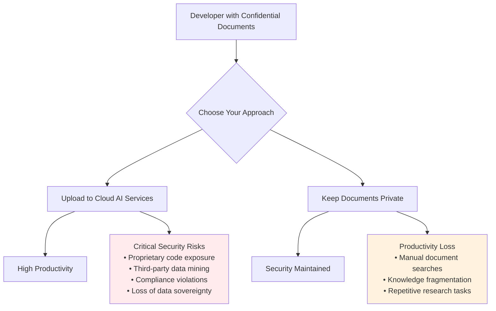
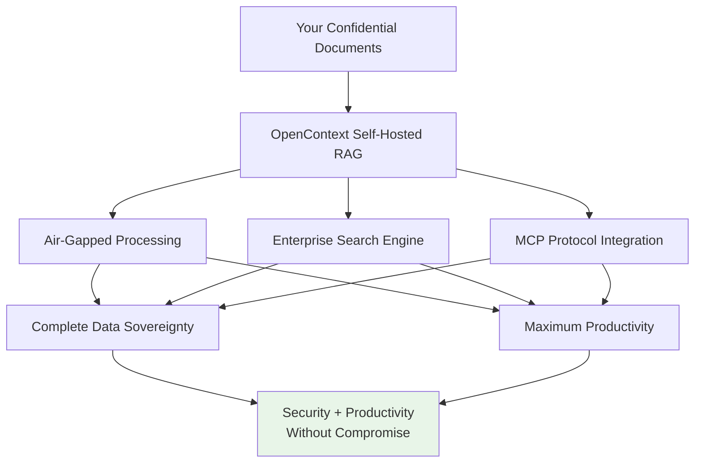
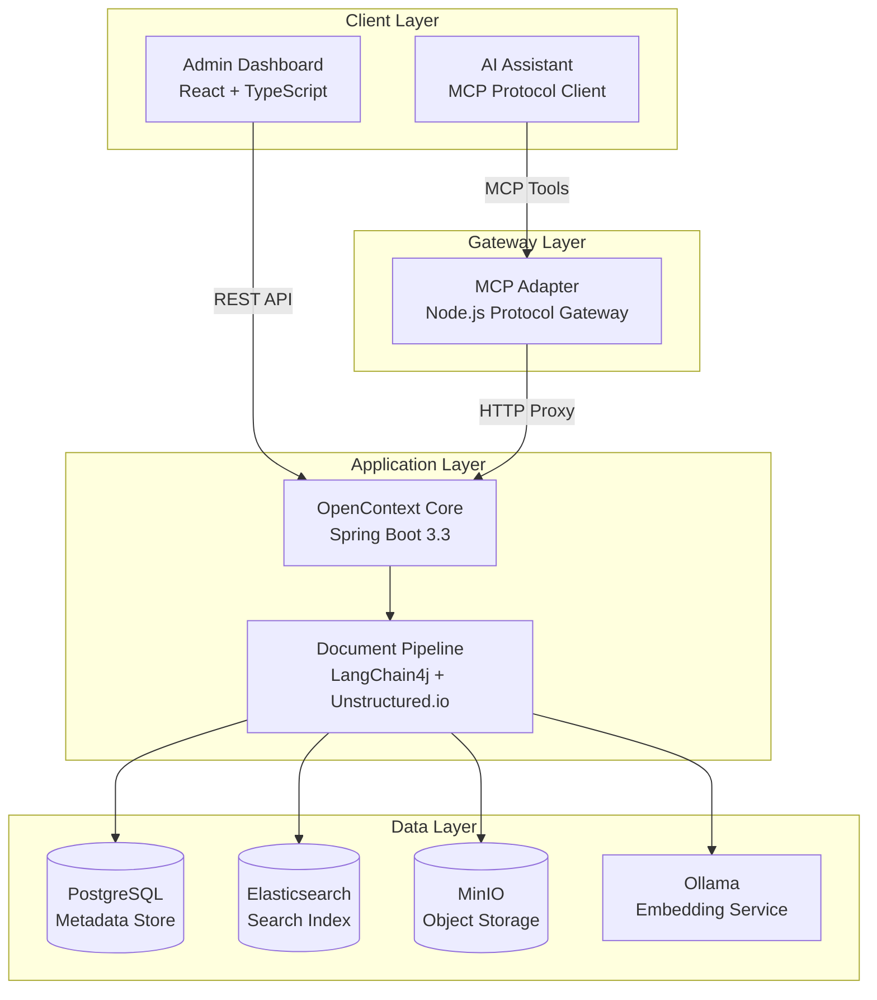
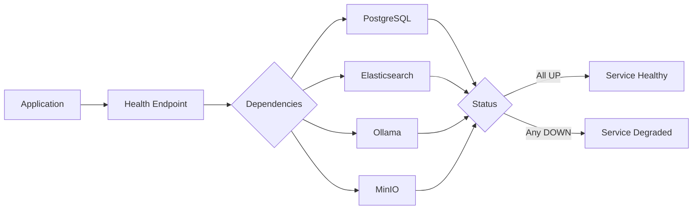

# OpenContext

[](https://opensource.org/licenses/Apache-2.0)
[](https://openjdk.org/projects/jdk/21/)
[](https://spring.io/projects/spring-boot)
[](https://reactjs.org/)
[](https://docs.docker.com/compose/)
[](https://modelcontextprotocol.io/)

**Secure, Self-Hosted RAG System for Confidential Documents**

An open-source RAG (Retrieval-Augmented Generation) system that eliminates the security risks of cloud-based AI tools while delivering enterprise-grade search capabilities for your most sensitive documents and proprietary code.

## The Problem We Solve

### The Security Dilemma of Modern AI Development

Developers today face an impossible choice between productivity and security:



### Critical Vulnerabilities in Current Solutions

**Cloud AI Services (ChatGPT, Claude, etc.)**
- **Data Harvesting**: Your proprietary code and internal documentation becomes training data for competitors
- **Vendor Lock-in**: No control over data retention, deletion, or access policies
- **Compliance Violations**: GDPR, HIPAA, SOX, and other regulations prohibit uploading sensitive data
- **Industrial Espionage**: Foreign-hosted services may provide government access to your IP
- **Supply Chain Attacks**: Third-party AI services can inject malicious responses or code

**Third-Party MCP Tools (Context7, etc.)**
- **Forced Data Upload**: Your private documents must be uploaded to their servers for processing
- **Opaque Processing**: No visibility into how your data is stored, processed, or shared
- **Malicious Code Injection**: External code suggestions may contain backdoors or vulnerabilities
- **Service Dependencies**: Your development workflow becomes dependent on external infrastructure
- **Cost Escalation**: Per-query pricing models make enterprise usage prohibitively expensive

### Real-World Impact on Organizations

**Financial Services Companies**
```
Problem: Trading algorithms and client data cannot be uploaded to external AI
Impact: Developers manually search through extensive compliance documentation
Challenge: Maintaining competitive advantage while ensuring regulatory compliance
```

**Healthcare Technology Organizations**
```
Problem: HIPAA regulations prevent using cloud AI with patient data documentation
Impact: Medical protocol documentation scattered across multiple systems
Challenge: Balancing research productivity with strict privacy requirements
```

**Defense and Government Contractors**
```
Problem: Classified documentation requires air-gapped environments
Impact: Engineers rely on manual knowledge retrieval processes
Challenge: Maintaining productivity in security-restricted environments
```

## Our Solution: Zero-Compromise Security with Maximum Productivity

OpenContext delivers a RAG system designed to eliminate the false choice between security and productivity:



### Why Self-Hosting is Non-Negotiable for Sensitive Data

**Complete Infrastructure Control**
- All processing happens within your network perimeter
- No external API calls or data transmission to third parties
- Full audit trail of all data access and processing activities
- Customizable security policies and access controls

**Regulatory Compliance by Design**
- GDPR Article 25: Data protection by design and by default
- HIPAA Technical Safeguards: Access control and audit controls
- SOX Section 404: Internal controls over financial reporting
- ISO 27001: Information security management systems

**Protection Against Supply Chain Attacks**
- Open source codebase available for security auditing
- No black-box AI services with unknown training data or behavior
- Deterministic, controllable AI model execution
- Protection against malicious code injection in AI responses

### Key Innovation: Two-Phase Retrieval

Unlike simple chatbots, OpenContext implements an intelligent two-phase approach:

1. **Exploratory Search**: "Show me what you have about Spring Security"
2. **Focused Retrieval**: "Give me the complete implementation details for JWT authentication"

This mirrors how human experts actually work - first understanding the landscape, then diving deep into specifics.

## Architecture Overview

OpenContext implements a two-phase retrieval strategy optimized for interactive knowledge discovery:



### Component Responsibilities

- **OpenContext Core**: Spring Boot application providing REST APIs and orchestrating document processing
- **MCP Adapter**: Protocol gateway translating MCP tool calls to HTTP requests
- **Admin Dashboard**: React-based web interface for document management and system monitoring  
- **Document Pipeline**: LangChain4j-based processing chain for parsing, chunking, and indexing
- **PostgreSQL**: Relational database storing document metadata and chunk hierarchy
- **Elasticsearch**: Search engine with hybrid BM25+vector capabilities and Korean language support
- **MinIO**: S3-compatible object storage for original document files
- **Ollama**: Local embedding model server running Qwen3-Embedding-0.6B

## Why Organizations Choose OpenContext

### Target Use Cases

OpenContext is designed for organizations that require:

**Financial Services**
- Protection of proprietary trading algorithms and client data
- Air-gapped development environments
- Regulatory compliance (SOX, PCI-DSS, etc.)

**Healthcare & Pharmaceuticals**
- HIPAA-compliant document processing
- Protection of research and patient data
- Secure access to historical clinical trial information

**Government & Defense**
- Classified document processing capabilities
- Offline operation in secure environments
- Full audit trail and access control

**Enterprise Technology**
- Protection of intellectual property and trade secrets
- Zero external dependencies for sensitive projects
- Customizable security controls and deployment options

## Key Features

### Enterprise-Grade Document Processing
- **Multi-format Support**: PDF and Markdown with preserving document structure
- **Hierarchical Chunking**: Maintains context relationships across document sections
- **Real-time Processing**: Live status tracking with detailed error reporting
- **Smart Deduplication**: Content-based detection prevents redundant processing
- **Batch Operations**: Efficient handling of large documentation sets

### Advanced Search Intelligence
- **Hybrid Search Engine**: Combines keyword precision with semantic understanding
- **Two-Phase Retrieval**: Exploratory discovery → focused content extraction
- **Multi-language Support**: Korean, Japanese, Chinese text analysis via Elasticsearch Nori
- **Relevance Tuning**: Configurable ranking algorithms for domain-specific optimization
- **Search Analytics**: Query performance monitoring and result quality metrics

### Zero-Compromise Security Architecture
- **Air-Gapped Deployment**: Complete network isolation with zero external dependencies
- **Data Sovereignty**: Your data never leaves your infrastructure or legal jurisdiction
- **Source Code Transparency**: Full open-source codebase available for security auditing
- **Encrypted Everything**: TLS 1.3 for transport, AES-256 for storage, encrypted embeddings
- **Comprehensive Audit Trail**: Every document access, search query, and system action logged
- **Configurable Access Controls**: Role-based permissions with API key rotation
- **Supply Chain Protection**: Verified build process with signed container images
- **Compliance Ready**: Built-in support for GDPR, HIPAA, SOX, and ISO 27001 requirements

## Quick Start

### Prerequisites

```bash
# System requirements
docker --version          # 20.10+
docker compose version    # 2.0+
free -h                   # 4GB+ RAM recommended
df -h                     # 10GB+ disk space required
```

### Installation

```bash
git clone https://github.com/your-org/open-context.git
cd open-context

# Start all services
docker compose up -d

# Verify deployment
docker compose ps
curl http://localhost:8080/actuator/health
```

### Service Endpoints

| Service | Port | Purpose |
|---------|------|---------|
| Core API | 8080 | Main application REST endpoints |
| Admin UI | 3001 | Web dashboard for document management |
| MCP Adapter | 3000 | Protocol gateway for AI assistant integration |
| Elasticsearch | 9200 | Search engine and vector store |
| PostgreSQL | 5432 | Relational database |
| MinIO | 9000 | Object storage service |
| Kibana | 5601 | Elasticsearch management interface |

## API Documentation

### MCP Protocol Tools

OpenContext exposes two tools via the Model Context Protocol:

#### find_knowledge
Performs exploratory search returning relevant document chunks.

**Request:**
```http
GET /api/v1/search?query=spring security jwt&topK=5
```

**Response:**
```json
{
  "success": true,
  "data": {
    "results": [
      {
        "chunkId": "uuid-string",
        "title": "JWT Authentication Configuration", 
        "snippet": "Configure JWT authentication in Spring Security...",
        "relevanceScore": 0.94
      }
    ]
  }
}
```

#### get_content
Retrieves full content of a specific document chunk.

**Request:**
```http
POST /api/v1/get-content
Content-Type: application/json

{
  "chunkId": "uuid-string",
  "maxTokens": 25000
}
```

**Response:**
```json
{
  "success": true,
  "data": {
    "content": "Complete chunk content here...",
    "tokenInfo": {
      "tokenizer": "tiktoken-cl100k_base",
      "actualTokens": 1247
    }
  }
}
```

### Administrative APIs

Document management endpoints requiring API key authentication:

```http
# Upload document
POST /api/v1/sources/upload
X-API-KEY: your-api-key
Content-Type: multipart/form-data

# List documents with pagination
GET /api/v1/sources?page=0&size=20&sort=createdAt,desc
X-API-KEY: your-api-key

# Trigger document reprocessing
POST /api/v1/sources/{id}/resync  
X-API-KEY: your-api-key

# Delete document and associated chunks
DELETE /api/v1/sources/{id}
X-API-KEY: your-api-key
```

## Technology Stack

### Backend
- **Java 21**: Latest LTS with virtual thread support
- **Spring Boot 3.3.11**: Enterprise application framework
- **LangChain4j 0.35.0**: RAG pipeline orchestration
- **PostgreSQL 16**: Relational data persistence
- **Elasticsearch 8.11**: Full-text search with vector capabilities
- **QueryDSL 5.x**: Type-safe query construction
- **Flyway**: Database schema migration management

### Frontend  
- **React 19**: Modern component-based UI framework
- **TypeScript**: Static type checking for enhanced development experience
- **Vite 7**: Fast build tooling and development server
- **Tailwind CSS 3**: Utility-first styling framework
- **TanStack Query v5**: Server state management and caching
- **Zustand**: Lightweight client state management

### Infrastructure
- **Docker Compose**: Multi-container application orchestration  
- **Ollama**: Local LLM serving with Qwen3-Embedding-0.6B model
- **MinIO**: S3-compatible object storage
- **Unstructured.io**: Document parsing and structure extraction

## Configuration

### API Key Management

**Default API Key**: The system comes with a development API key `dev-api-key-123`. **Change this for production use.**

**To change the API key:**

1. **For Docker deployment**, set environment variable:
```bash
# In your shell or .env file
export OPENCONTEXT_API_KEY="your-secure-production-key"

# Generate a secure key
openssl rand -hex 32
```

2. **For local development**, edit `application.yml`:
```yaml
opencontext:
  api:
    key: your-secure-production-key
```

**Using the API key:**
```bash
# All Admin API calls require the X-API-KEY header
curl -H "X-API-KEY: your-secure-production-key" \
  http://localhost:8080/api/v1/sources
```

### Embedding Model Configuration

**Default Model**: `dengcao/Qwen3-Embedding-0.6B:F16` (1024 dimensions)

**To change embedding models:**

1. **Choose a compatible model from Ollama:**
```bash
# List available embedding models
docker compose exec ollama ollama list

# Pull a different model (example)
docker compose exec ollama ollama pull nomic-embed-text
docker compose exec ollama ollama pull mxbai-embed-large
```

2. **Update configuration** in `application-docker.yml`:
```yaml
app:
  ollama:
    embedding:
      model: nomic-embed-text  # or your chosen model
```

3. **Important**: Verify embedding dimensions match your Elasticsearch mapping:
```bash
# Check model info
docker compose exec ollama ollama show nomic-embed-text
```

**Supported embedding models:**
- `nomic-embed-text` (768 dimensions) - English optimized
- `mxbai-embed-large` (1024 dimensions) - Multilingual
- `bge-large-en` (1024 dimensions) - High quality English
- `bge-m3` (1024 dimensions) - Multilingual, includes Korean

### MCP Integration Setup

**For AI Assistants (Cursor, VSCode, etc.):**

1. **Install the MCP server:**
```bash
# The MCP adapter runs as a Docker service
docker compose up -d open-context-mcp-adapter
```

2. **Register with your AI assistant:**

**MCP Configuration:**

**For Cursor/VSCode:**
```json
{
  "mcpServers": {
    "opencontext": {
      "url": "http://localhost:3000/mcp"
    }
  }
}
```

**For other MCP clients:**
```json
{
  "mcpServers": {
    "opencontext": {
      "type": "streamable-http",
      "url": "http://localhost:3000/mcp"
    }
  }
}
```

**Note:** The MCP server runs in HTTP mode and requires an MCP client for communication. Direct execution is not possible.

3. **Verify MCP connection:**

**HTTP Endpoint Tests:**
```bash
# Health check
curl http://localhost:3000/health

# Server information
curl http://localhost:3000/info

# Ping test
curl http://localhost:3000/ping
```

**MCP Protocol Test (requires MCP client):**
```bash
# Note: Direct tool testing is not possible without an MCP client
# Use Cursor/VSCode MCP integration or MCP Inspector for actual tool testing
```

### Advanced Configuration

**Search tuning** in `application.yml`:
```yaml
app:
  search:
    snippet-max-length: 50      # Snippet length in characters
    bm25-weight: 0.3           # Keyword search weight (0.0-1.0)
    vector-weight: 0.7         # Semantic search weight (0.0-1.0)
  embedding:
    batch-size: 10             # Documents processed per batch
  content:
    default-max-tokens: 25000  # Maximum tokens per content response
    tokenizer: tiktoken-cl100k_base
```

**Document processing** configuration:
```yaml
opencontext:
  processing:
    chunk-size: 1000           # Characters per chunk
    chunk-overlap: 200         # Overlap between chunks
```

**File upload limits:**
```yaml
spring:
  servlet:
    multipart:
      max-file-size: 100MB     # Maximum single file size
      max-request-size: 100MB  # Maximum total request size
```

### Environment Variables

```bash
# Core application
SPRING_PROFILES_ACTIVE=docker
OPENCONTEXT_API_KEY=your-secure-key

# Database
POSTGRES_DB=opencontext
POSTGRES_USER=user
POSTGRES_PASSWORD=secure-password

# Object storage
MINIO_ROOT_USER=minioadmin
MINIO_ROOT_PASSWORD=secure-password

# Optional: GPU acceleration for Ollama
OLLAMA_RUNTIME=nvidia
```

## Development

### Local Development Setup

```bash
# Backend development
cd core
./gradlew bootRun

# Frontend development  
cd admin-ui
npm install
npm run dev

# MCP adapter development
cd mcp-adapter
npm install
npm run dev
```

### Database Management

```bash
# Apply migrations
./gradlew flywayMigrate

# View migration status
./gradlew flywayInfo

# Repair migration checksums
./gradlew flywayRepair
```

### Testing

```bash
# Unit tests
./gradlew test

# Integration tests with TestContainers
./gradlew integrationTest

# Test coverage report
./gradlew jacocoTestReport

# Frontend tests
cd admin-ui
npm test
```

## Monitoring and Operations

### Health Checks



Access monitoring endpoints:
- Health: `http://localhost:8080/actuator/health`
- Metrics: `http://localhost:8080/actuator/metrics`
- Application info: `http://localhost:8080/actuator/info`

### Performance Considerations

| Component | Resource Requirements | Scaling Notes |
|-----------|---------------------|---------------|
| Core Application | 2GB RAM, 2 CPU cores | Stateless, horizontally scalable |
| PostgreSQL | 1GB RAM, SSD storage | Read replicas for query scaling |
| Elasticsearch | 2GB RAM, fast disk | Cluster deployment for HA |
| Ollama | 4GB RAM, GPU optional | Model caching, batch processing |

### Log Management

```bash
# View application logs
docker compose logs -f open-context-core

# Search-specific logging
docker compose logs -f elasticsearch

# System-wide logging
docker compose logs --tail=100
```

## Production Deployment

### Docker Compose Production

```yaml
# docker-compose.prod.yml
version: '3.8'
services:
  open-context-core:
    image: opencontext/core:1.0.0
    environment:
      SPRING_PROFILES_ACTIVE: prod
      OPENCONTEXT_API_KEY: ${API_KEY}
    deploy:
      replicas: 2
      resources:
        limits:
          memory: 4G
          cpus: '2'
```

### Security Hardening

```bash
# Generate secure API key
openssl rand -hex 32

# Configure TLS termination
# Use reverse proxy (nginx/traefik) for HTTPS

# Network isolation
# Deploy in isolated Docker network
# Configure firewall rules for port access
```

### Backup Strategy

```bash
# Database backup
docker compose exec postgres pg_dump -U user opencontext > backup.sql

# Elasticsearch snapshot
curl -X PUT "localhost:9200/_snapshot/backup_repo/snapshot_1"

# MinIO data backup  
mc mirror minio/opencontext-documents /backup/documents/
```

## Open Source Community

### Why We Open Sourced OpenContext

**Transparency Builds Trust**: Security-critical software must be auditable. Every line of code is open for inspection, ensuring no backdoors or data harvesting mechanisms exist.

**Community-Driven Security**: Open source transparency enables security professionals to review the code, helping identify and address vulnerabilities through collaborative development.

**Customization Freedom**: Organizations can modify OpenContext to meet their specific security requirements, compliance standards, and operational needs.

**No Vendor Lock-in**: You own your deployment, your data, and your destiny. No licensing fees, usage limits, or forced upgrades.

### Contributing to OpenContext

We welcome contributions from security professionals, developers, and organizations who understand the critical importance of data sovereignty.

#### High-Impact Contribution Areas

**Security Enhancements**
- Advanced encryption implementations
- Zero-knowledge proof integration
- Hardware security module (HSM) support
- Differential privacy mechanisms

**Enterprise Features**
- SAML/OIDC authentication integration
- Advanced role-based access control (RBAC)
- Multi-tenant deployment architectures
- Kubernetes operator development

**Performance Optimizations**
- Distributed search capabilities
- GPU acceleration for embeddings
- Caching layer implementations
- Query optimization algorithms

**Integration Adapters**
- Additional MCP protocol tools
- Enterprise document management systems
- Version control system integrations
- Monitoring and alerting systems

#### Development Workflow

1. **Fork and Branch**: Create feature branch from latest `develop`
2. **Security Review**: All code changes undergo security-focused review
3. **Comprehensive Testing**: Unit, integration, and security tests required
4. **Documentation**: Update API docs, security considerations, and deployment guides
5. **Community Review**: Pull requests reviewed by maintainers and community

#### Code Standards and Security Requirements

- **Java**: Google Java Style Guide with additional security annotations
- **TypeScript**: Prettier + ESLint with security-focused rules
- **Security**: OWASP secure coding standards, dependency vulnerability scanning
- **Testing**: 90% code coverage requirement, security test cases mandatory
- **Audit Trail**: All code changes must maintain audit logging capabilities

#### Community Support

- **GitHub Discussions**: Architecture decisions, feature planning, security considerations
- **Security Advisory**: Responsible disclosure of vulnerabilities
- **Documentation Wiki**: Community-maintained deployment guides and best practices
- **Monthly Community Calls**: Feature roadmap discussions and security updates

## License

Licensed under the Apache License, Version 2.0. See [LICENSE](LICENSE) file for full license text.

## Support

- **Bug Reports**: [GitHub Issues](../../issues)
- **Feature Requests**: [GitHub Discussions](../../discussions)
- **Documentation**: [Project Wiki](../../wiki)